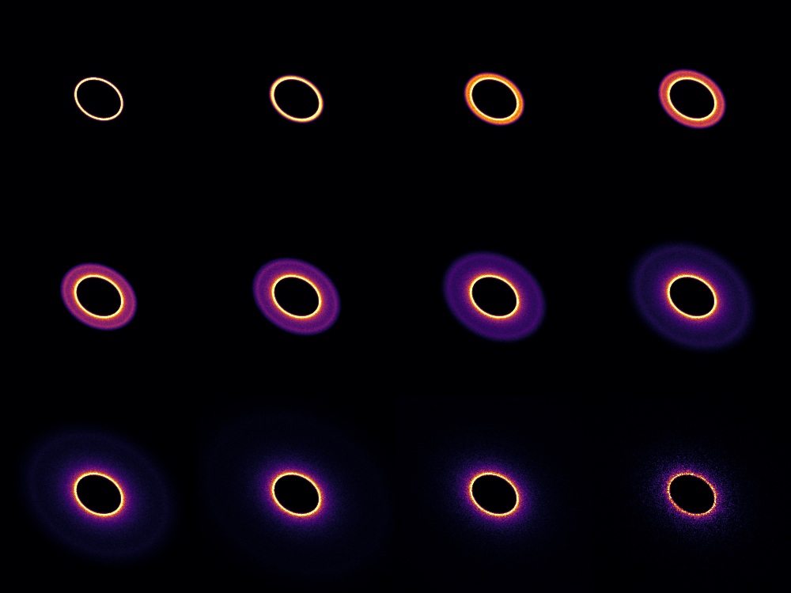

# betadisk

A python class to produce images of debris disks, as a function of different grain sizes. It works for scattered light images as well as for thermal emission (with some crude-ish approximation for the dust temperature).

Radiation pressure increases the eccentricity of the particles, and the increase depends on their sizes. The idea here is to consider a size distribution, and instead of creating one single image, the size distribution is binned in `ng` intervals, and `ng` images are created, to capture the different spatial scales of the debris disk. Afterwards, you can for instance do all sorts of linear combination to find the images that best reproduce your observations.

The main motivation of the approach is to get rid of as many assumptions regarding the dust properties as possible. Therefore, instead of working directly with the "true" size of the particles, the code directly uses the $\beta$ values (the ratio between radiation pressure and gravitational forces). Regardless of the luminosity or mass of the star, you should always have a distribution of $\beta$ values, ranging between 0 and 0.5 (one could argue that this might not be the case for low mass stars, but their could be stellar winds, etc). Then, you can a posteriori try to relate the $\beta$ values with the actual grain sizes. In the end, you can produce images as follows, where $\beta$ increases from the top left down to the bottom right.



As $\beta$ increases (smaller grain sizes), the disk becomes more and more radially extended. For the last image, the orbits are so spread out because of the high eccentricity ($e \sim 0.95$) that we start to see some "noise" even in the main belt. This could be avoided by increasing the number of dust particles (though there are 10 000 000 in this example).

## Installation

Simply clone the repository, change to the directory and install using the `develop` option.

```python
python3 setup.py develop
```

The dependencies are `numpy`, `matplotlib` (though technically not necessary except for the example), and most importantly `numba` to speed things up a little. With [`numba`](https://numba.pydata.org/) you have the possibility to pre-compile parts of the code, which can significantly improve the runtime speed. In our case, since we will be launching many particles, and do very simple math operations, this is quite invaluable.

Once you cloned and installed the repository, you should therefore compile some of the code by running

```python
python3 frame.py
```

and this will create a directory called 'frame.cpython-38-x86_64-linux-gnu.so' (name will vary depending on your operating system). And that's it, you should be able to succesfully run the following

```python
python3 betadisk.py
```


